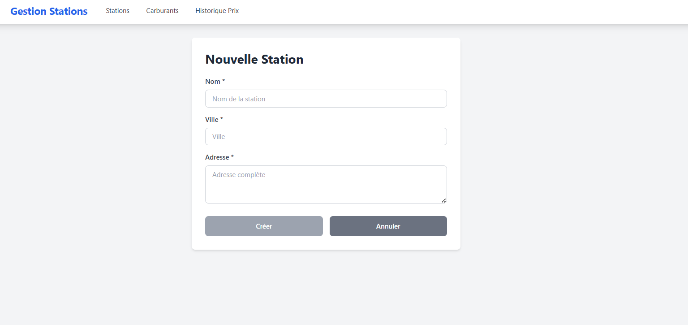
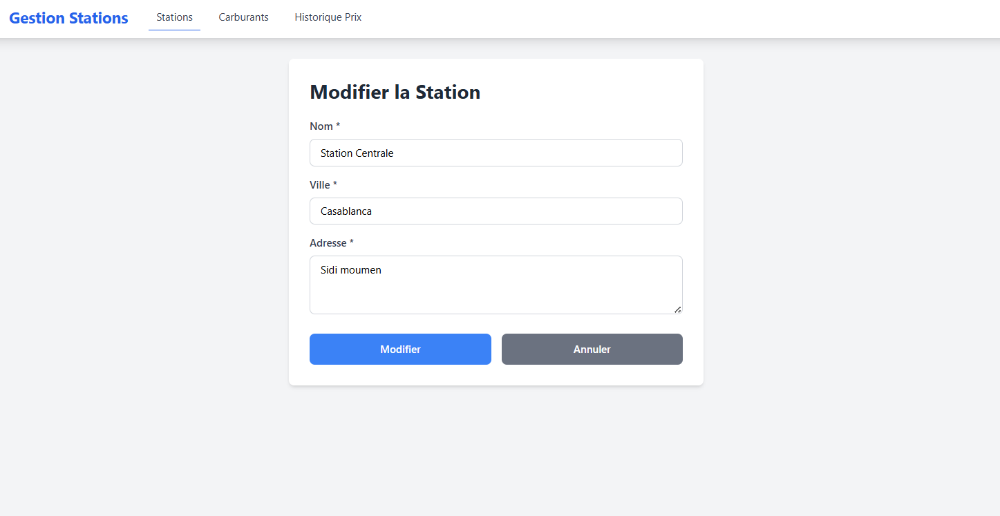
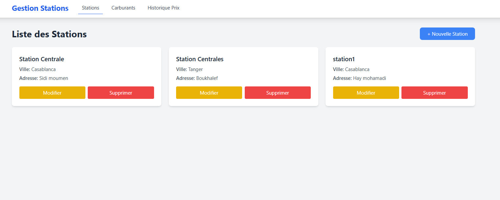
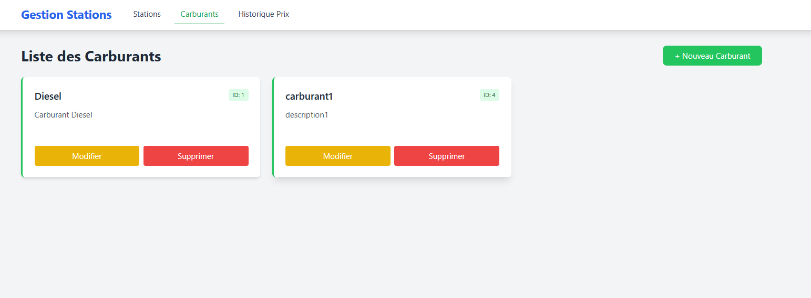
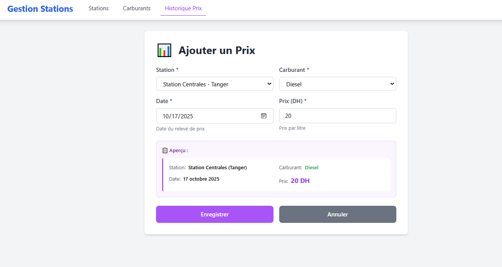
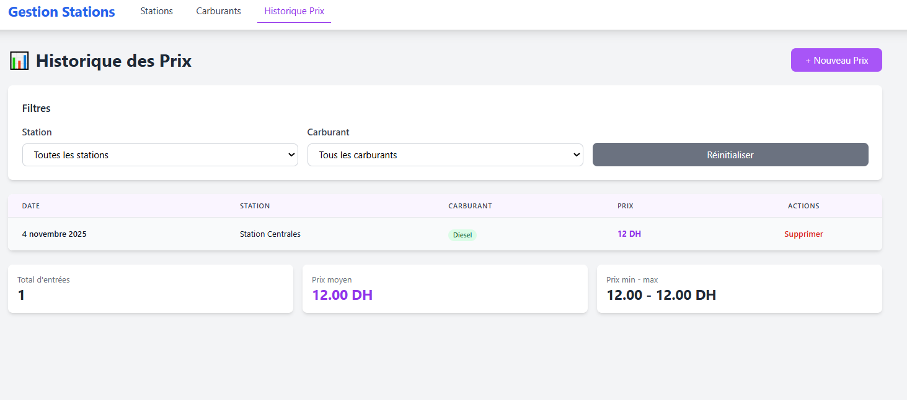

# Rapport d’Analyse du Dépôt Frontend : Gestion de Stations-Service

Ce document présente l’analyse du code **frontend** développé dans le cadre du projet *Gestion de Stations*.  
Ce frontend Angular est conçu pour interagir avec le backend Jakarta EE disponible sur le dépôt suivant :  
➡️ [Atelier5_backend sur GitHub](https://github.com/ahyahya1616/Atelier5_backend)

---

## 1. Technologies et Outils Utilisés

Le projet frontend repose sur les technologies suivantes :

* **Framework :** Angular
* **Langage principal :** TypeScript
* **Gestion des routes :** Angular Router
* **Communication HTTP :** HttpClient
* **Modularité :** Découpage en composants (formulaire et liste)
* **Interopérabilité :** Appels REST vers le backend Jakarta EE déployé sur WildFly

---

## 2. Structure du Projet

Le projet Angular est organisé de manière claire et modulaire.

### 📁 `components/`
Contient trois sous-dossiers principaux correspondant aux entités gérées :
- `station/`
- `carburant/`
- `histoCarb/`

Chaque sous-dossier contient deux composants :
- `*-form.component.ts` → Formulaire d’ajout / modification
- `*-list.component.ts` → Liste des éléments existants

### 📁 `services/`
Contient les services Angular permettant la communication avec l’API REST du backend via **HttpClient**.

### 📁 `models/`
Définit les interfaces TypeScript utilisées dans l’application.

---

## 3. Routage et Configuration

Le fichier **`app.routes.ts`** définit les routes principales de l’application :

```typescript
import { Routes } from '@angular/router';
import { StationListComponent } from './components/station/station-list.component';
import { StationFormComponent } from './components/station/station-form.component';
import { CarburantListComponent } from './components/carburant/carburant-list.component';
import { CarburantFormComponent } from './components/carburant/carburant-form.component';
import { HistoCarbListComponent } from './components/histoCarb/histocarb-list.component';
import { HistoCarbFormComponent } from './components/histoCarb/histocarb-form.component';

export const routes: Routes = [
{ path: '', redirectTo: '/stations', pathMatch: 'full' },
{ path: 'stations', component: StationListComponent },
{ path: 'stations/create', component: StationFormComponent },
{ path: 'stations/edit/:id', component: StationFormComponent },
{ path: 'carburants', component: CarburantListComponent },
{ path: 'carburants/create', component: CarburantFormComponent },
{ path: 'carburants/edit/:id', component: CarburantFormComponent },
{ path: 'histocarb', component: HistoCarbListComponent },
{ path: 'histocarb/create', component: HistoCarbFormComponent }
];
```
---

Le fichier **`app.config.ts`** configure les services nécessaires au fonctionnement global :

```typescript
import { ApplicationConfig, provideZoneChangeDetection } from '@angular/core';
import { provideRouter } from '@angular/router';
import { routes } from './app.routes';
import { provideHttpClient } from '@angular/common/http';

export const appConfig: ApplicationConfig = {
providers: [
provideZoneChangeDetection({ eventCoalescing: true }),
provideRouter(routes),
provideHttpClient()
]
};

export const APP_CONFIG = {
apiBaseUrl: 'http://localhost:8080/Atelier5_backend-1.0-SNAPSHOT/api'
};
```
---

## 4. Modèles de Données (Interfaces)

Les interfaces permettent de typer les données échangées avec l’API :

```typescript
export interface Station {
id?: number;
nom: string;
ville: string;
adresse: string;
}

export interface Carburant {
id?: number;
nom: string;
description: string;
}

export interface HistoCarb {
id?: number;
date: string;
prix: number;
stationId: number;
carburantId: number;
}

export interface HistoCarbDisplay extends HistoCarb {
stationNom?: string;
carburantNom?: string;
}
```
---

## 5. Fonctionnalités Principales

### 🚉 Gestion des Stations

- **Ajout d’une station**  
  Permet d’ajouter une nouvelle station avec ses informations (nom, ville, adresse).  
  

- **Modification d’une station existante**  
  L’utilisateur peut modifier les informations d’une station.  
  

- **Liste des stations**  
  Affichage de toutes les stations avec options de suppression ou modification.  
  

---

### ⛽ Gestion des Carburants

- **Ajout d’un carburant**  
  Formulaire pour créer un nouveau type de carburant.  
  

- **Liste des carburants disponibles**  
  Tableau affichant les carburants existants avec leurs descriptions.  
  *(Image à insérer : liste des carburants)*

---

###  Historique des Prix

- **Ajout de prix pour une station**  
  Formulaire pour enregistrer le prix d’un carburant dans une station donnée.  
  

- **Consultation de l’historique des prix**  
  Liste filtrable des historiques de prix par station et par carburant.  
  

---

## 6. Communication avec le Backend

Le frontend communique avec l’API REST Jakarta EE via les services Angular.  
Les URLs sont construites à partir de la constante `APP_CONFIG.apiBaseUrl`.

Exemple d’appel HTTP typique :

```typescript
this.http.get(`${APP_CONFIG.apiBaseUrl}/stations`);
```
Les données échangées sont en format **JSON**, assurant la compatibilité entre Angular et le backend Jakarta EE.

---

## 7. Conclusion

Le frontend Angular complète parfaitement le backend Jakarta EE, offrant une interface utilisateur claire pour :

* la gestion des **stations-service**,
* la gestion des **carburants**,
* et le suivi de **l’historique des prix**.

###  Points forts :
* Architecture modulaire et maintenable.
* Bonne séparation entre la logique de présentation et la logique métier.
* Intégration fluide avec le backend RESTful.

### 🔧 Améliorations possibles :
* Ajouter une pagination pour les listes.
* Améliorer le design avec un framework UI (Angular Material).

